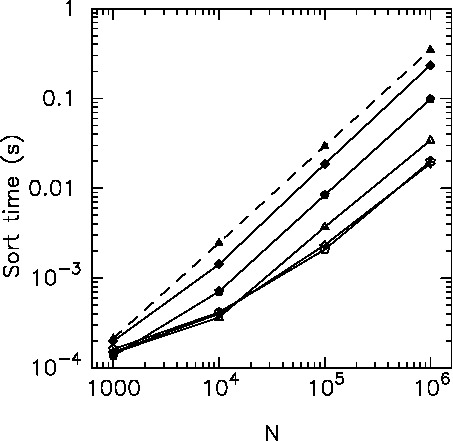

# sortlib

An experimental code for test/improve the performance of parallel
sort

you can try this with

```
  make -f Makefile.sorttest sorttest
  env OMP_NUM_THREADS=4 sorttest  1500
```
The output would look like
```
Time to sort = 0.00029669 0.000591706 0.00015421
Parallel sort success for n=1500 nthreads=4!
Parallel sort success!
```
First number indicates the time for std:sort (single thread),
and second and third both show the times for parallel sample sort,
for the first and second calls. Since the overhead of multithread
execution is the largest for the first call, I show the times for
first and second calls.

## Usage as header-only library

```
   #include "PATH/OF/THIS/FILE/samplesortlib.hpp"
```


Provide:
```
   template<class T>
   void samplesort(T * b, int n)
```
and
```
   template<class T, class GetKey>
   void samplesort(T * b, int n, GetKey getkey)
```
   in namespace SampleSortLib

b is the pointer to array (could be vector?) of class T and
n is the number of elements

To use the first form, class T should provide a member function getsortkey()
using which this function sort te array. In the second form the
function to get the sort key is given as the third argument. For
example, if we want to sort n elements of class B in stored in array a
using the member variable x as key, we write
```
    SampleSortLib::samplesort(a, n,  [](B & b) ->auto{return b.x;} );
```

The old name samplesort_bodies is kept for compatibility.

## Limitations


Assumes that the stack size is large enough to place working arrays
(n*(sizeof(T)+32) bytes). Use ulimit -h (or limit stacksize in Csh),
or modify the code so that it uses new/delete or other memory
management schemes.

Switches from single-thread std::sort to parallel sort at
size=1000. This might not be the optimum position to switch depending
on architecture.

## Performance sample



Measured on Fugaku using sorttest.cpp. N is the number of
elements. Sort time is in seconds. The dashed curve with filled
triangles is the time for std::sort. Filled squares, pentagons,
open triangles, squares and pentagons are the results of
samplesort_bodies called with 2, 4,  12,
24, 48 threads.

## Algorithm

Sample sort with sorting applied to index-value pairs (locally
generated). The original array is reordered according to the sorted
index-value pair. Thus this library is optimized for classes with
relatively large sizes (more than 32 bytes).
